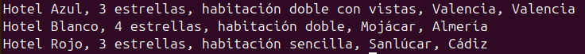

# Prueba técnica PHP – Hospedajes (MVC + MySQLi + PHPUnit)

**Autor:** Roberto Carlos Moyano Torres
**Fecha:** 29 Septiembre 2025

## TL;DR
Aplicación en **PHP 8** (sin frameworks, solo POO) que:  
- Lee por **STDIN** las tres primeras letras introducidas.  
- Busca coincidencias en la base de datos (Hoteles y Apartamentos).  
- Devuelve resultados formateados por **STDOUT**, ordenados por nombre.  
- Incluye **tests con PHPUnit** y **scripts SQL** para crear y poblar la base de datos.  


Aplicación en PHP orientada a objetos (sin frameworks) que, tomando **las tres primeras letras de la entrada estándar (STDIN)**, devuelve por **la salida estándar (STDOUT)** todas las coincidencias de hospedajes de una base de datos MySQL, ordenadas por nombre.  

## ⚙️ Entorno utilizado
- Portátil personal con **Linux (Ubuntu)** en máquina física  
- **PHP 8.3.6** con extensiones `mysqli`, `mbstring`  
- **Mysql 8.0.43**
- **Composer 2.7.1** para gestión de dependencias  
- **PHPUnit 12.3** para los tests  

## Requisitos
- PHP 8.x con extensiones `mysqli`, `mbstring`
- MySQL o MariaDB
- Composer

## Instalación
1. Clonar el proyecto o descomprimir el zip.
2. Instalar dependencias:

```bash
composer install
```

3. Crear la base de datos:

```bash
mysql -u root -p < ./database.sql
```

## Ejemplo de búsqueda desde terminal:

```bash
echo "Hotel" | php public/index.php
```

## Salida esperada:
Hotel Azul, 3 estrellas, habitación doble con vistas, Valencia, Valencia
Hotel Blanco, 4 estrellas, habitación doble, Mojácar, Almería
Hotel Rojo, 3 estrellas, habitación sencilla, Sanlúcar, Cádiz

## Tests
Ejecutar PHPUnit:

```bash
./vendor/bin/phpunit
```

Los tests incluyen:
- Unitarios: comprobación de clases Hotel y Apartment.
- Integración: comprobación del controlador contra la base de datos.

## Captura de la app funcionando
A continuación una captura de la aplicación en ejecución:



